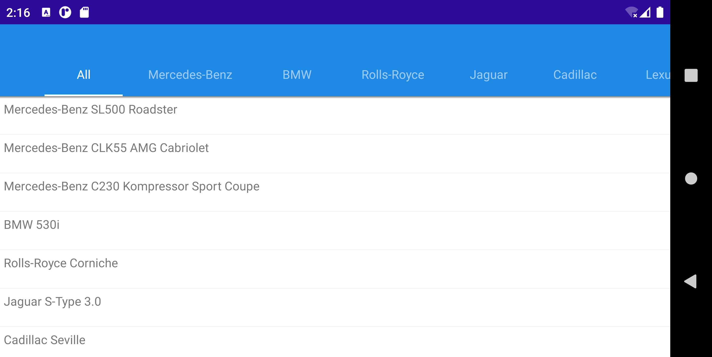

<!-- default file list -->
*Files to look at*:

* [MauiProgram.cs](./TabPage_GenerateItems/MauiProgram.cs)
* [MainPage.xaml](./TabPage_GenerateItems/MainPage.xaml)
* [MainPage.xaml.cs](./TabPage_GenerateItems/MainPage.xaml.cs)
* [CarModel.cs](./TabPage_GenerateItems/CarModel.cs)
* [CarBrandViewModel.cs](./TabPage_GenerateItems/CarBrandViewModel.cs)
* [BoolToColorConverter.cs](./TabPage_GenerateItems/BoolToColorConverter.cs)
* [MainViewModel.cs](./TabPage_GenerateItems/MainViewModel.cs)
<!-- default file list end -->

# Generate MAUI Tab Page Items from a Data Source

This lesson explains how to use the [TabPage](http://docs.devexpress.com/MAUI/DevExpress.Maui.Navigation.TabPage) component with tab items generated from a data source to create a tab bar that allows users to filter lists. 

1. Install a [.NET MAUI development](https://docs.microsoft.com/en-gb/dotnet/maui/get-started/installation) environment and open the solution in Visual Studio 2022.
2. Register the following NuGet feed in Visual Studio: `https://nuget.devexpress.com/free/api`.  
	If you are an active DevExpress [Universal](https://www.devexpress.com/subscriptions/universal.xml) customer or have registered our [free Xamarin UI controls](https://www.devexpress.com/xamarin/), this MAUI preview will be available in your personal NuGet feed automatically.
4. Restore NuGet packages.  
5. Run the application on an Android or iOS device or emulator.  



The following step-by-step instructions describe how to create the same application.

## Create a New MAUI Application and Add a Tab Page

Create a new .NET MAUI solution in Visual Studio 22 Preview. Refer to the following Microsoft documentation for more information on how to get started with .NET MAUI: [.NET Multi-platform App UI](https://docs.microsoft.com/en-gb/dotnet/maui/).

Register `https://nuget.devexpress.com/free/api` as a package source in Visual Studio, if you are not an active DevExpress [Universal](https://www.devexpress.com/subscriptions/universal.xml) customer or have not yet registered our [free Xamarin UI controls](https://www.devexpress.com/xamarin/).

Install the **DevExpress.Maui.Navigation** package from your NuGet feed.

In the *MauiProgram.cs* file, call the **UseDevExpress** method to register handlers for the `TabPage` and other DevExpress controls:

```cs
using Microsoft.Maui;
using Microsoft.Maui.Hosting;
using Microsoft.Maui.Controls.Hosting;
using DevExpress.Maui;

namespace TabPage_GenerateItems {
    public static class MauiProgram {
        public static MauiApp CreateMauiApp() {
            var builder = MauiApp.CreateBuilder();
            builder
                .UseMauiApp<App>()
                .UseDevExpress()
                .ConfigureFonts(fonts =>
                {
                    fonts.AddFont("OpenSans-Regular.ttf", "OpenSansRegular");
                });
            return builder.Build();
        }
    }
}
```

In the *MainPage.xaml* file, use the *dxn* prefix to declare the **DevExpress.Maui.Navigation** namespace and create a [TabPage](http://docs.devexpress.com/MAUI/DevExpress.Maui.Navigation.TabPage) instance:

```xaml
<dxn:TabPage xmlns="http://schemas.microsoft.com/dotnet/2021/maui"
             xmlns:x="http://schemas.microsoft.com/winfx/2009/xaml"
             xmlns:dxn="clr-namespace:DevExpress.Maui.Navigation;assembly=DevExpress.Maui.Navigation"
             x:Class="TabPage_GenerateItems.MainPage">
</dxn:TabPage>
```

In the *MainPage.xaml.cs* file, change the MainPage’s base class from ContentPage to TabPage:

```cs
using DevExpress.Maui.Navigation;

namespace TabPage_GenerateItems {
    public partial class MainPage : TabPage {
        public MainPage() {
            InitializeComponent();
        }
    }
}
```

## Create Models and View Models

Add a **CarModel** class that specifies a data object in the application:

```cs
namespace TabPage_GenerateItems {
    public class CarModel {
        public string BrandName { get; }
        public string ModelName { get; }
        public string FullName => $"{BrandName} {ModelName}";

        public CarModel(string brand, string model) {
            this.BrandName = brand;
            this.ModelName = model;
        }
    }
}
```

Create a **CarBrandViewModel** class that defines content for the tab page: car make and corresponding models. This view model will be used to display brands as tabs in the header and matching models in the tab item’s content area:

```cs
using System;
using System.Linq;
using System.ComponentModel;
using System.Collections.Generic;
using System.Runtime.CompilerServices;

namespace TabPage_GenerateItems {
    public class CarBrandViewModel : INotifyPropertyChanged {
        private bool isSelected = false;
        public string BrandName { get; }
        public IReadOnlyList<CarModel> CarModels { get; }

        // This property is used to change the appearance of a tab depending on its state. 
        public bool IsSelected {
            get { return isSelected; }
            set {
                if (value == isSelected) return;
                isSelected = value;
                RaisePropertyChanged();
            }
        }

        public event PropertyChangedEventHandler PropertyChanged;

        public CarBrandViewModel(string brandName, IEnumerable<CarModel> carModels) {
            if (String.IsNullOrEmpty(brandName)) {
                this.BrandName = String.Empty;
            }
            else {
                this.BrandName = brandName;
            }
            if (carModels == null) {
                this.CarModels = new List<CarModel>();
            }
            else {
                this.CarModels = carModels.ToList();
            }
        }
        private void RaisePropertyChanged([CallerMemberName] string caller = "") {
            PropertyChangedEventHandler handler = PropertyChanged;
            if (handler != null) {
                handler.Invoke(this, new PropertyChangedEventArgs(caller));
            }
        }
    }
}
```

Create a **MainViewModel** class that defines content for the MainPage (models grouped by make/brand):

```cs
using System.Linq;
using System.ComponentModel;
using System.Collections.Generic;
using System.Runtime.CompilerServices;

namespace TabPage_GenerateItems {
    public class MainViewModel : INotifyPropertyChanged {
        private const int UnselectedIndex = -1;
        private static readonly IReadOnlyList<CarModel> allCarModels = new List<CarModel> {
            new CarModel("Mercedes-Benz", "SL500 Roadster"),
            new CarModel("Mercedes-Benz", "CLK55 AMG Cabriolet"),
            new CarModel("Mercedes-Benz", "C230 Kompressor Sport Coupe"),
            new CarModel("BMW", "530i"),
            new CarModel("Rolls-Royce", "Corniche"),
            new CarModel("Jaguar", "S-Type 3.0"),
            new CarModel("Cadillac", "Seville"),
            new CarModel("Cadillac", "DeVille"),
            new CarModel("Lexus", "LS430"),
            new CarModel("Lexus", "GS430"),
            new CarModel("Ford", "Ranger FX-4"),
            new CarModel("Dodge", "RAM 1500"),
            new CarModel("GMC", "Siera Quadrasteer"),
            new CarModel("Nissan", "Crew Cab SE"),
            new CarModel("Toyota", "Tacoma S-Runner"),
        };

        public IReadOnlyList<CarBrandViewModel> CarModelsByBrand { get; }

        int selectedIndex = UnselectedIndex;
        public int SelectedIndex {
            get => selectedIndex;
            set {
                if (selectedIndex == value) return;
                if (selectedIndex != UnselectedIndex) {
                    CarModelsByBrand[selectedIndex].IsSelected = false;
                }
                selectedIndex = value;
                if (selectedIndex != UnselectedIndex) {
                    CarModelsByBrand[selectedIndex].IsSelected = true;
                }
                RaisePropertyChanged();
            }
        }

        public event PropertyChangedEventHandler PropertyChanged;

        public MainViewModel() {
            List<CarBrandViewModel> carBrandViewModels = new List<CarBrandViewModel>();
            carBrandViewModels.Add(new CarBrandViewModel("All", allCarModels));

            IEnumerable<IGrouping<string, CarModel>> groupedCarModels = 
                                                        allCarModels.GroupBy(v => v.BrandName);
            foreach (IGrouping<string, CarModel> carModelGroup in groupedCarModels) {
                carBrandViewModels.Add(new CarBrandViewModel(carModelGroup.Key, carModelGroup));
            }
            CarModelsByBrand = carBrandViewModels;
        }

        private void RaisePropertyChanged([CallerMemberName] string caller = "") {
            PropertyChangedEventHandler handler = PropertyChanged;
            if (handler != null) {
                handler.Invoke(this, new PropertyChangedEventArgs(caller));
            }
        }
    }
}
```


## Bind the Tab Page to View Models

In the *MainPage.xaml* file:

1. Assign a **MainViewModel** instance to the **TabPage.BindingContext** property.
2. Bind the TabPage’s [ItemsSource](http://docs.devexpress.com/MAUI/DevExpress.Maui.Navigation.TabPage.ItemsSource) property to the **CarModelsByBrand** property of the view model, and the [SelectedItemIndex](http://docs.devexpress.com/MAUI/DevExpress.Maui.Navigation.TabPage.SelectedItemIndex) property to the view model’s **SelectedIndex** property.
3. Use the [ItemHeaderTemplate](http://docs.devexpress.com/MAUI/DevExpress.Maui.Navigation.TabPage.ItemHeaderTemplate) property to define the tab item header’s appearance, and the [ItemTemplate](http://docs.devexpress.com/MAUI/DevExpress.Maui.Navigation.TabPage.ItemTemplate) property to specify a page displayed in the tab item’s content area.

```xaml
<dxn:TabPage xmlns="http://schemas.microsoft.com/dotnet/2021/maui"
             xmlns:x="http://schemas.microsoft.com/winfx/2009/xaml"
             xmlns:dxn="clr-namespace:DevExpress.Maui.Navigation;assembly=DevExpress.Maui.Navigation"
             xmlns:local="clr-namespace:TabPage_GenerateItems"
             x:Class="TabPage_GenerateItems.MainPage"
             ItemsSource="{Binding CarModelsByBrand}"
             SelectedItemIndex="{Binding SelectedIndex, Mode=TwoWay}">
    <dxn:TabPage.BindingContext>
        <local:MainViewModel/>
    </dxn:TabPage.BindingContext>
    <dxn:TabPage.ItemHeaderTemplate>
        <DataTemplate>
            <Label Text="{Binding BrandName}"
                   HorizontalOptions="Center"
                   VerticalOptions="CenterAndExpand"/>
        </DataTemplate>
    </dxn:TabPage.ItemHeaderTemplate>
    <dxn:TabPage.ItemTemplate>
        <DataTemplate>
            <ContentPage>
                <ListView ItemsSource="{Binding CarModels}">
                    <ListView.ItemTemplate>
                        <DataTemplate>
                            <ViewCell>
                                <Label Padding="5" Text="{Binding FullName}" />
                            </ViewCell>
                        </DataTemplate>
                    </ListView.ItemTemplate>
                </ListView>
            </ContentPage>
        </DataTemplate>
    </dxn:TabPage.ItemTemplate>
</dxn:TabPage>
```

## Customize the Tab Page
Configure the appearance of the TabPage’s header panel and header items.

Specify the minimum and maximum sizes of items, the spacing between them, and item padding:

```xaml
<dxn:TabPage xmlns="http://schemas.microsoft.com/dotnet/2021/maui"
             xmlns:x="http://schemas.microsoft.com/winfx/2009/xaml"
             xmlns:dxn="clr-namespace:DevExpress.Maui.Navigation;assembly=DevExpress.Maui.Navigation"
             xmlns:local="clr-namespace:TabPage_GenerateItems"
             x:Class="TabPage_GenerateItems.MainPage"
             ItemsSource="{Binding CarModelsByBrand}"
             SelectedItemIndex="{Binding SelectedIndex, Mode=TwoWay}"
             ItemHeaderMinWidth="90"
             ItemHeaderMaxWidth="360"
             HeaderPanelItemSpacing="8">
    <dxn:TabPage.BindingContext>
        <local:MainViewModel/>
    </dxn:TabPage.BindingContext>
    <dxn:TabPage.ItemHeaderTemplate>
        <DataTemplate>
            <Label Text="{Binding BrandName}"
                   HorizontalOptions="Center"
                   VerticalOptions="CenterAndExpand"
                   Padding="5,0"/>
        </DataTemplate>
    </dxn:TabPage.ItemHeaderTemplate>
    <!-- Other Tab Page settings.-->
</dxn:TabPage>
```
Use the [TabPage.HeaderPanelBackgroundColor](https://docs.devexpress.com/MAUI/DevExpress.Maui.Navigation.TabPage.HeaderPanelBackgroundColor) property to specify the background color of the header panel. The `Label.TextColor` property specifies the color of labels in the panel. We use the following converter to convert a Boolean value in the view model to a `Color` structure.

```cs
using System;
using System.ComponentModel;
using System.Globalization;
using Microsoft.Maui.Controls;
using Microsoft.Maui.Graphics;

namespace TabPage_GenerateItems
{
    public class BoolToColorConverter:IValueConverter {
        public Color FalseSource { get; set; }
        public Color TrueSource { get; set; }

        public object Convert(object value, Type targetType, object parameter, CultureInfo culture) {
            if (!(value is bool)) {
                return null;
            }
            return (bool)value ? TrueSource : FalseSource;
        }

        public object ConvertBack(object value, Type targetType, object parameter, CultureInfo culture) {
            throw new NotImplementedException();
        }
    }
}
```

```xaml
<dxn:TabPage xmlns="http://schemas.microsoft.com/dotnet/2021/maui"
             xmlns:x="http://schemas.microsoft.com/winfx/2009/xaml"
             xmlns:dxn="clr-namespace:DevExpress.Maui.Navigation;assembly=DevExpress.Maui.Navigation"
             xmlns:local="clr-namespace:TabPage_GenerateItems"
             x:Class="TabPage_GenerateItems.MainPage"
             ItemsSource="{Binding CarModelsByBrand}"
             SelectedItemIndex="{Binding SelectedIndex, Mode=TwoWay}"
             ItemHeaderMinWidth="90"
             ItemHeaderMaxWidth="360"
             HeaderPanelItemSpacing="8"
             HeaderPanelBackgroundColor="#1e88e5">
    <dxn:TabPage.Resources>
        <ResourceDictionary>
            <local:BoolToColorConverter x:Key="boolToColorConverter"
                                              DefaultColor="Transparent"
                                              SelectedColor="#40FFFFFF"/>
        </ResourceDictionary>
    </dxn:TabPage.Resources>
    <dxn:TabPage.ItemHeaderTemplate>
        <DataTemplate>
           <Label
              x:Name="label"
              Margin="16,48,16,16"
              HorizontalOptions="Center"
              VerticalOptions="Center"
              TextColor="{Binding IsSelected, Converter={StaticResource boolToColorConverter}}"
              Text="{Binding BrandName}"
              HorizontalTextAlignment="Center"
              Padding="5,0"/>
        </DataTemplate>
    </dxn:TabPage.ItemHeaderTemplate>
    <!-- Other Tab Page settings.-->
</dxn:TabPage>
```

Customize the header panel shadow and specify the margins and text color for header items:

```xaml
<dxn:TabPage xmlns="http://schemas.microsoft.com/dotnet/2021/maui"
             xmlns:x="http://schemas.microsoft.com/winfx/2009/xaml"
             xmlns:dxn="clr-namespace:DevExpress.Maui.Navigation;assembly=DevExpress.Maui.Navigation"
             xmlns:local="clr-namespace:TabPage_GenerateItems"
             x:Class="TabPage_GenerateItems.MainPage"
             ItemsSource="{Binding CarModelsByBrand}"
             SelectedItemIndex="{Binding SelectedIndex, Mode=TwoWay}"
             ItemHeaderMinWidth="90"
             ItemHeaderMaxWidth="360"
             HeaderPanelItemSpacing="8"
             HeaderPanelBackgroundColor="#1e88e5"
             HeaderPanelShadowHeight="3"
             HeaderPanelShadowRadius="3"
             IsSelectedItemIndicatorVisible="True"
	     SelectedItemIndicatorColor="White">
    <dxn:TabPage.ItemHeaderTemplate>
        <DataTemplate>
           <Label
              x:Name="label"
              Margin="16,48,16,16"
              HorizontalOptions="Center"
              VerticalOptions="Center"
              TextColor="{Binding IsSelected, Converter={StaticResource boolToColorConverter}}"
              Text="{Binding BrandName}"
              HorizontalTextAlignment="Center"
              Padding="5,0"/>
        </DataTemplate>
    </dxn:TabPage.ItemHeaderTemplate>
    <!-- Other Tab Page settings.-->
</dxn:TabPage>
```
