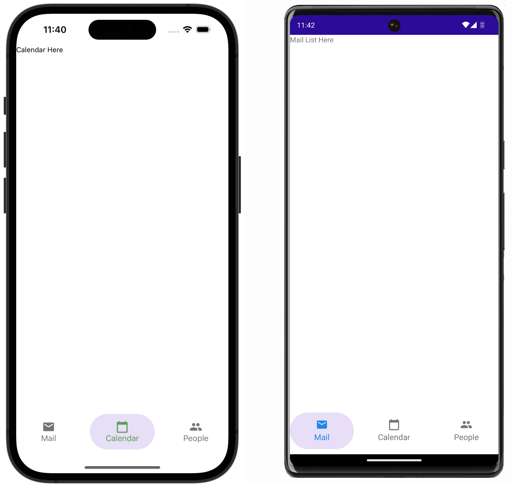
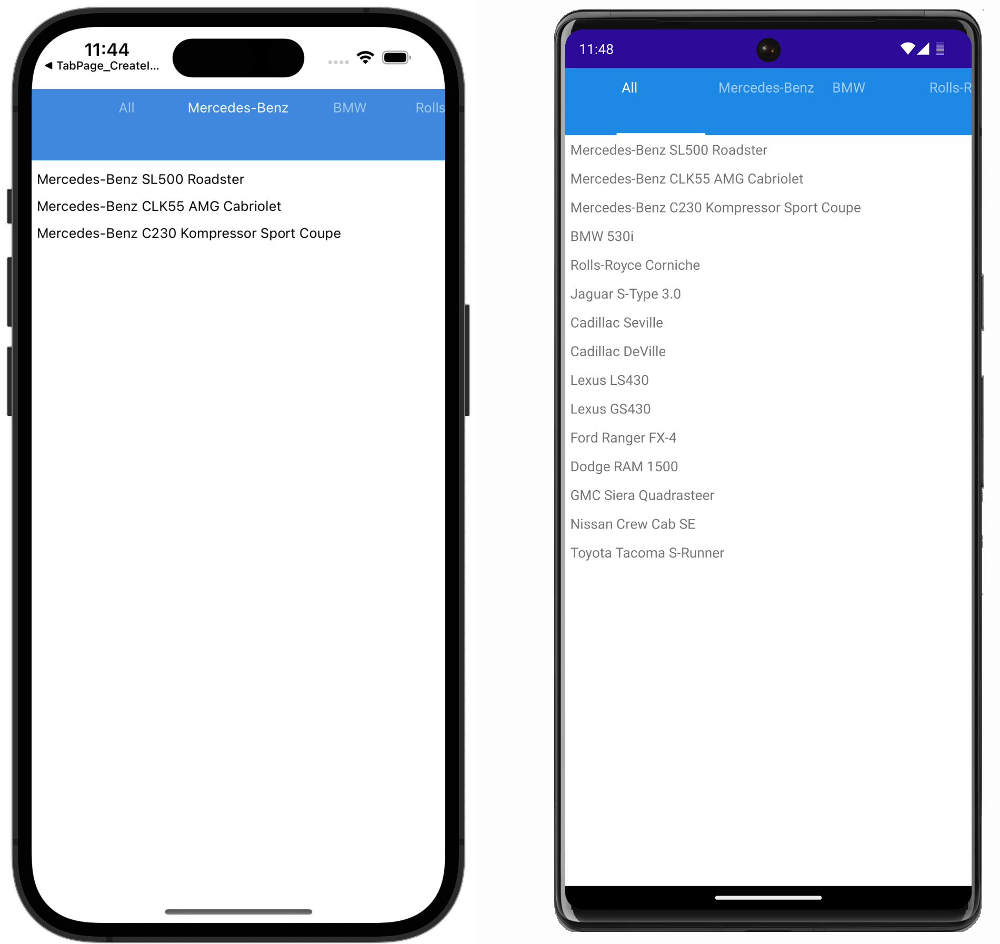

<!-- default badges list -->

<!-- default badges end -->
# Tabs for .NET MAUI

[DevExpress Mobile UI](https://www.devexpress.com/maui/) allows you to use a .NET cross-platform UI toolkit and C# to build native apps for iOS and Android.

The **DevExpress Mobile UI for Xamarin.Forms and .NET MAUI** is free of charge. To learn more about our offer and to reserve your copy, visit [Free DevExpress Mobile UI for Xamarin.Forms and .NET MAUI](https://www.devexpress.com/xamarin-free).

## Requirements

Please register the DevExpress NuGet Gallery in Visual Studio to restore the NuGet packages used in this solution. See the following topic for more information: [Get Started with DevExpress Mobile UI for .NET MAUI](https://docs.devexpress.com/MAUI/403249/get-started).

You can also refer to the following YouTube video for more information on how to get started with the DevExpress .NET MAUI Controls: [Setting up a .NET MAUI Project](https://www.youtube.com/watch?v=juJvl5UicIQ).

## What's in This Repository

In v22.1.1-pre-22115, the **DevExpress Mobile UI for .NET MAUI** suite does not include the `TabPage`, `DrawerPage`, and `DrawerView` components that were supported in previous previews. See the following breaking change for more information: [Navigation controls for .NET MAUI have been removed](https://supportcenter.devexpress.com/internal/ticket/details/T1085745).

This example shows how to replace the `TabPage` with the `TabView` to implement a similar functionality. See the following pull request for changes: [Replace TabPage with TabView](https://github.com/DevExpress-Examples/maui-tab-page-get-started/pull/3/files).

### Populate a TabPage Manually

The [CreateTabItemsManually](./CS/CreateTabItemsManually/) project explains how to use the [TabPage](http://docs.devexpress.com/MAUI/DevExpress.Maui.Controls.TabPage) component with manually created tab items to implement bottom tab navigation in a .NET MAUI application.

### Generate Items

The [GenerateTabItemsFromDataSource](./CS/GenerateTabItemsFromDataSource/) project explains how to use the [TabPage](http://docs.devexpress.com/MAUI/DevExpress.Maui.Controls.TabPage) component with tab items generated from a data source to create a tab bar that allows users to filter lists. 

## Documentation

- [Data Grid](https://docs.devexpress.com/MAUI/403255/data-grid/data-grid)
- [Charts](https://docs.devexpress.com/MAUI/403300/charts/charts)
- [Data Form](https://docs.devexpress.com/MAUI/403640/data-form)
- [Navigation](https://docs.devexpress.com/MAUI/403297/navigation/index)
- [Data Editors](https://docs.devexpress.com/MAUI/403427/editors/index)
- [Collection View](https://docs.devexpress.com/MAUI/403324/collection-view/index)

## More Examples

* [Stocks App](https://github.com/DevExpress-Examples/maui-stocks-mini)
* [Data Grid](https://github.com/DevExpress-Examples/maui-data-grid-get-started)
* [Data Form](https://github.com/DevExpress-Examples/maui-data-form-get-started)
* [Charts](https://github.com/DevExpress-Examples/maui-charts)
* [Scheduler](https://github.com/DevExpress-Examples/maui-scheduler-get-started)
* [Tab View](https://github.com/DevExpress-Examples/maui-tab-view-get-started)
* [Drawer Page](https://github.com/DevExpress-Examples/maui-drawer-page-get-started)
* [Drawer View](https://github.com/DevExpress-Examples/maui-drawer-view-get-started)
* [Collection View](https://github.com/DevExpress-Examples/maui-collection-view-get-started)
* [Popup](https://github.com/DevExpress-Examples/maui-popup-get-started)
